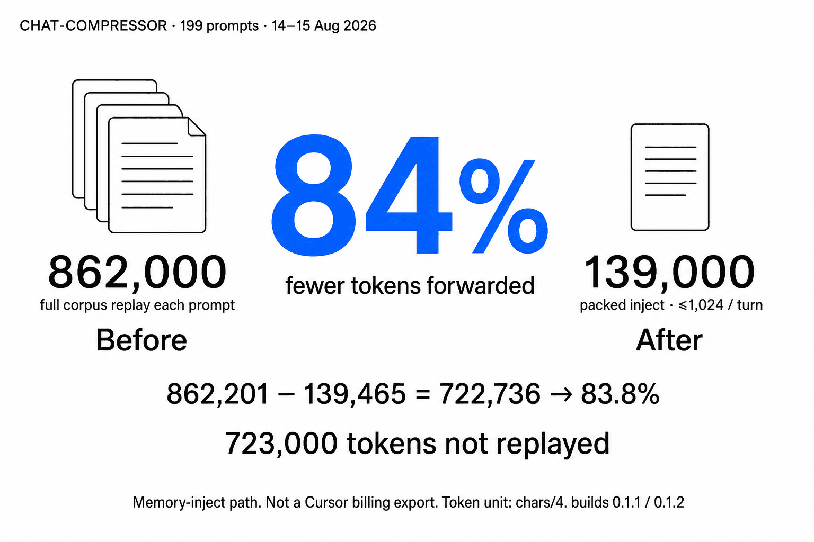

# comPREssOR

## What this is

`comPREssOR` (extension id `soltrinox.compressor`) is a **Cursor-only extension**
that injects bounded compressed session memory into **Agent Chat**, so long
sessions can keep continuity without replaying huge transcripts every turn.

| Term | Meaning here |
| --- | --- |
| **Cursor** | A desktop IDE (VS Code–compatible) used for AI-assisted development — people building with AI agents in-editor, not a separate chat website. |
| **Extension** | A plugin you install into that IDE. It adds features (hooks, settings, lifecycle) inside Cursor; it does not replace the editor. |
| **comPREssOR** | The plugin that packs local compressed session state and forwards a budgeted gist into Agent Chat. |

**Mechanism → outcome → scope**

1. **Mechanism:** watches Agent Chat hook events, stores compressed state on disk
   (default `$HOME/.cursor/context-graphs/`), and projects a pack ordered as
   `HOT_SET` → typed graph lines → query-ranked chunks, capped per turn
   (default ≤1,024 estimated tokens).
2. **Observable outcome:** later turns receive continuity for paths, open items,
   decisions, and selected spans from that bounded pack — without stuffing the
   full transcript into the inject channel.
3. **Token spend (scoped):** this is continuity / insurance against wasteful
   replay on the memory-inject path. On a 199-prompt corpus, packed inject
   forwarded about **one sixth** the estimated tokens of full-corpus replay
   (**84% fewer**, `chars/4`) — not a Cursor billing export. Net spend drops
   only if the gist replaces a paste or post-compact replay; Cursor still sends
   native chat history. Hooks are fail-open.

How to install today: [docs/PREFLIGHT.md](docs/PREFLIGHT.md).  
Why bounded packs beat raw replay: [docs/WHY.md](docs/WHY.md).  
Measured figures and honesty bounds: [docs/PERFORMANCE.md](docs/PERFORMANCE.md).  
Formal model: [docs/THEORY.md](docs/THEORY.md).

> **Status:** v0.2.0 — install via **VSIX sideload** today. Open VSX listing is
> pending (namespace / human publish). See
> [docs/PREFLIGHT.md](docs/PREFLIGHT.md) and
> [docs/PUBLISHING.md](docs/PUBLISHING.md).

<p align="center">
  
</p>

<p align="center">
  <strong>84% fewer</strong> forwarded · <strong>139k</strong> vs <strong>862k</strong> · <strong>≤1,024</strong> / turn, median <strong>783</strong>
</p>

<p align="center">
  On a 199-prompt corpus (14–15 Aug 2026), packed inject forwarded about
  <strong>one sixth</strong> the estimated tokens of full-corpus replay
  (<strong>84% fewer</strong>). Memory-inject path (<code>chars/4</code>),
  not a Cursor billing export.<br />
  On this inject-path comparison, packed volume is about
  <strong>18¢ on the replay dollar</strong>
  (~<strong>6×</strong> as far for the same inject budget).
  Estimated forwarded tokens vs full-corpus replay — not a Cursor billing export.<br />
  <a href="docs/PERFORMANCE.md">How this was measured</a>
</p>

<a href="docs/THEORY.md" title="Open formal model">
<blockquote>
<p><strong>Formal model</strong> — pack under estimator $\tau$, dual state $S_t=(G_t,C_t)$:</p>

$$
\tau(x)=\max\!\left(1,\ \left\lfloor\frac{|x|+3}{4}\right\rfloor\right)
\quad(x\neq\varepsilon),\qquad
P_t=\Pi(S_t,q_t;B_t),\quad \tau(P_t)\le B_t\le B_{\max}
$$

$$
\Delta=\sum_t\tau(R_t)-\sum_t\tau(P_t),\qquad
\eta=1-\frac{\sum_t\tau(P_t)}{\sum_t\tau(R_t)}
\quad(\text{inject path; }862201\to139465\Rightarrow\eta\approx0.838)
$$

<p><strong>Read the equations →</strong> <sub>docs/THEORY.md · code-backed · not a billing claim</sub></p>
</blockquote>
</a>

## Install

**Primary path today: sideload a VSIX.** Open VSX listing is pending — Extensions
search is not yet the install path for most users.

1. Download a release VSIX from
   [GitHub Releases (latest)](https://github.com/soltrinox/comPREssOR/releases/latest)
   (v0.2.0 asset: `compressor-0.2.0.vsix`), **or** build from this repo:

```bash
cd extension && npm ci && npm run package
```

2. In Cursor: **Extensions** → **⋯** → **Install from VSIX…**  
   (or Command Palette: **Extensions: Install from VSIX**). Choose the
   downloaded release asset or `compressor-*.vsix` under `extension/`.
3. Reload when prompted. On first allowed activation (Cursor desktop only),
   comPREssOR provisions Python 3.11+, writes the env file, installs the hook
   shim, merges hook entries, and deploys its user rule and skill.

Host gate, first-run lifecycle, and settings:
[docs/PREFLIGHT.md](docs/PREFLIGHT.md), [docs/SYSTEM.md](docs/SYSTEM.md),
[docs/COMPATIBILITY.md](docs/COMPATIBILITY.md).

## vs other prompt continuity approaches

Before each turn, some systems re-send prior prompt text into the model context.
comPREssOR instead maintains local state and injects a budgeted pack. On a
199-prompt corpus, that pack was about one sixth the estimated tokens of
replaying the ingested corpus (~18¢ on the replay dollar). Separately, a
vocabulary-bag baseline was smaller than the pack but hit zero fixture recall —
so “most compressed” is the wrong leaderboard.

| Approach | What it puts in the prompt | Measured here? | Size / utility note |
| --- | --- | --- | --- |
| Paste / replay prior prompts into `additional_context` | Growing corpus every turn | Yes — inject corpus | $1.00 replay dollar; packed ≈ **18¢** (~**6×** as far) |
| Last-N truncation | Tail of the thread only | No | Cheap; can drop early decisions |
| One-shot summary | Prose digest | No | Can drop paths/open items |
| Vocabulary / bag compression | Tiny word list | Yes — SDK probe | 27 tokens, **recall 0.00** — size wins, utility fails |
| Codebase RAG | Repo chunks | No / N/A | Different problem; comPREssOR is not RAG |
| **comPREssOR pack** | `HOT_SET` → typed → ranked ≤1,024 | Yes — both probes | Inject: ~1/6 replay volume; SDK: 184 tokens, recall 0.33, ~34% fewer billed **on that probe** |

18¢ / 6× is a **ratio illustration** of inject-path volume vs replaying this
corpus as `additional_context`, not a Cursor invoice. Net spend drops only if
the gist replaces a paste or post-compact replay. Native history is still sent.

Full card walk + two-probe table → [docs/PERFORMANCE.md](docs/PERFORMANCE.md).

## What it does / is not

Long Agent Chat sessions often lose earlier decisions or require expensive raw
transcript replay. comPREssOR keeps local compressed state and injects a bounded
text payload ordered as `HOT_SET`, typed graph lines, and query-ranked chunks.

The observable outcome is continuity for paths, open items, decisions, and
selected spans without forwarding the full transcript on every turn.

Scope boundary: comPREssOR is a context-assembly mechanism. It is not codebase
RAG, not a model, not hidden-state transport, and not a guarantee of better
answers. Hooks add a gist; they do not strip Cursor's native chat history. Net
spend drops only if the gist replaces a paste or post-compact replay. For the
inject-corpus walk-through, read [docs/PERFORMANCE.md](docs/PERFORMANCE.md). For
theory and the separate SDK probe, read [docs/WHY.md](docs/WHY.md).

## What To Expect

- Cursor desktop only. Unsupported hosts may install a VSIX, but activation
  refuses side effects and writes nothing under the Cursor data directory.
- Python 3.11+ is required. On first allowed activation, the extension provisions
  a private venv and installs the bundled engine wheel into it.
- Hooks are fail-open. If the shim, venv, state directory, or engine is
  unavailable, the Agent Chat turn proceeds without injected context.
- The hook path does not need a Cursor API key and the extension does not write
  one into managed configuration.
- Local state defaults to `$HOME/.cursor/context-graphs/`.
- Settings are projected into `$HOME/.cursor/chat-compressor.env`, preserving
  unmanaged lines.
- User hooks install `$HOME/.cursor/hooks/chat-compressor.sh` and merge four
  events into `$HOME/.cursor/hooks.json`.

Cursor-only behavior and the sideload boundary are documented in
[docs/COMPATIBILITY.md](docs/COMPATIBILITY.md). System behavior and settings are
documented in [docs/SYSTEM.md](docs/SYSTEM.md).

## Use It Well

Keep related work in one Agent conversation when continuity matters. Write
durable facts as explicit paths, open items, decisions, and headings. Mark
completed work directly so old open items can be superseded.

Tune `chatCompressor.forwardBudget` when recall needs change. Prefer packed
memory over pasting a full transcript for continuity, and attach or cite source
files directly when exact wording is required. Use project hooks only when a
repository should explicitly carry hook configuration.

## Lab/live SDK probe (separate measurement)

The hero figures above are the 199-prompt inject corpus (`chars/4`), not billed
cost. A separate lab/live SDK probe compared raw replay, a legacy vocabulary-bag
replica, and the current comPREssOR pack. The inbound baseline was about
78,876 chars / 19,719 estimated tokens.

| Arm | Final-turn estimated forward tokens | `entity_recall` | Live billed total |
| --- | ---: | ---: | ---: |
| Raw replay | 19938 | 1.00 | 31971 |
| Legacy vocabulary bag | 27 | 0.00 | 22352 |
| comPREssOR pack | 184 | 0.33 | 21050 |

`entity_recall` is a fixture term-hit proxy, not answer correctness. Live billed
usage includes the SDK envelope, so billed input is not the same as gist-only
payload size. On this probe, the comPREssOR pack used about 34% fewer billed
tokens than raw replay. Do not merge that 34% billed result with the 84%
inject-path figure. Details: [docs/WHY.md](docs/WHY.md).

## Requirements

- Cursor desktop. See [docs/COMPATIBILITY.md](docs/COMPATIBILITY.md).
- Python 3.11 or newer, discoverable on the machine or configured with
  `chatCompressor.pythonPath`.
- Network access on first activation when Python wheels need to be installed.

## Docs

- [docs/PERFORMANCE.md](docs/PERFORMANCE.md): 199-prompt inject corpus, card
  sequence, locked numerals, and the two-probe table.
- [docs/WHY.md](docs/WHY.md): why bounded forward context can beat raw replay,
  plus the lab/live SDK probe.
- [docs/THEORY.md](docs/THEORY.md): formal model — equations, operator/constant
  registries, and honesty ledger for the packer and dual state.
- [docs/SYSTEM.md](docs/SYSTEM.md): architecture, lifecycle, settings, and use
  patterns.
- [docs/ARCHITECTURE.md](docs/ARCHITECTURE.md): documentation index.
- [docs/HOOK_CONTRACT.md](docs/HOOK_CONTRACT.md): hook events and fail-open
  defaults.
- [docs/PREFLIGHT.md](docs/PREFLIGHT.md): host facts and current VSIX sideload
  install path (Open VSX pending).
- [docs/PUBLISHING.md](docs/PUBLISHING.md): Open VSX publishing checklist
  (gallery install after human publish). Tagged releases attach a VSIX to
  GitHub Releases even when `OVSX_TOKEN` is unset; Open VSX publish is skipped
  until the secret is configured.

## Licence

Apache-2.0. See [LICENSE](LICENSE).

---

## Elsewhere

```
author :: Rosario
roles  :: developer · architect · mathematician
```

- [`ENI6MA.com`](https://eni6ma.com) — authentication product surface. Mechanism: mint a **one-shot proof** bound to a single request (apps, agents, paper). Outcome: the verifier observes allow/deny for that action; a spent proof does not replay as standing authority. Scope: Public / Cloud / Sovereign stacks under the published reference architecture and claim model — not a reusable password/token vault.
- [`RosarioCyber.com`](https://rosariocyber.com) — Rosario Cybernetics research lab. Focus: cybersecurity, cryptography, and AI-safety research that feeds ENI6MA (password-free auth demos, audit-trail posture, seminar/colloquium material). Contact path for partnerships/licensing sits with the lab.

```
© 2026 Rosario. All rights reserved.
Source copyright: Rosario (developer, architect, mathematician).
Licensed under Apache-2.0 for redistribution terms — see LICENSE.
```

### `eof`

Pack local state. Forward a bounded gist. Keep the rest on disk.
