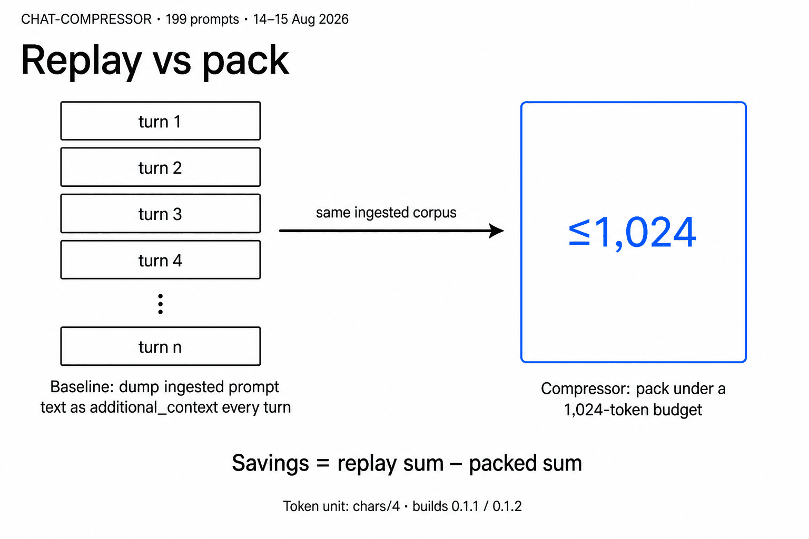
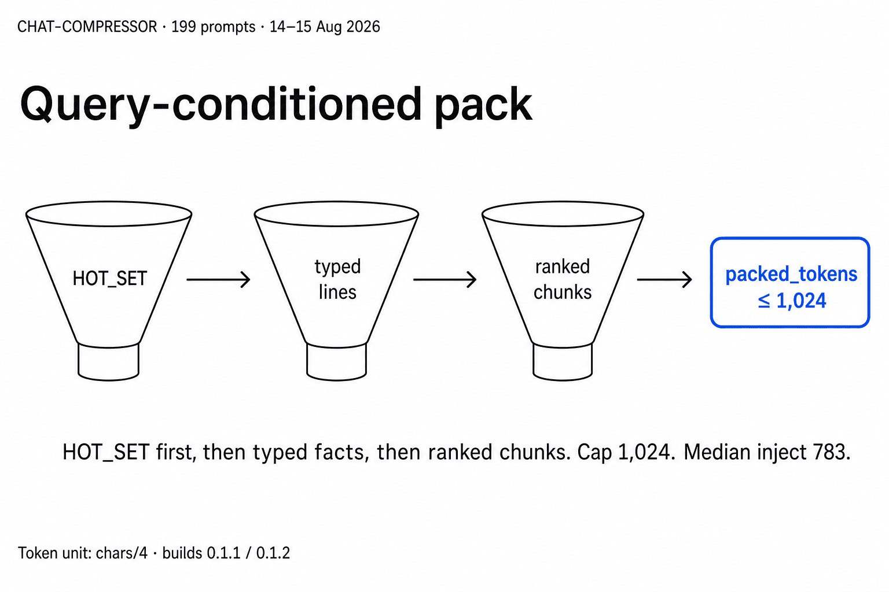
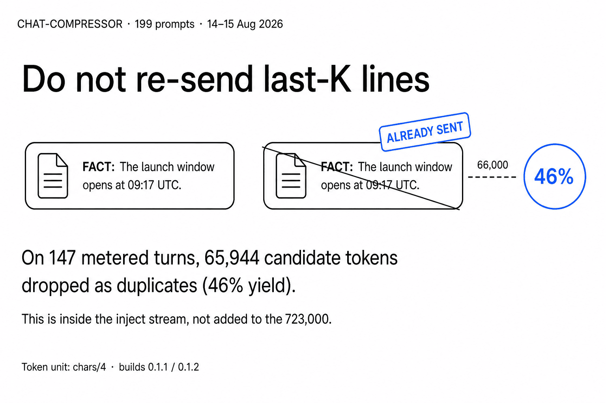
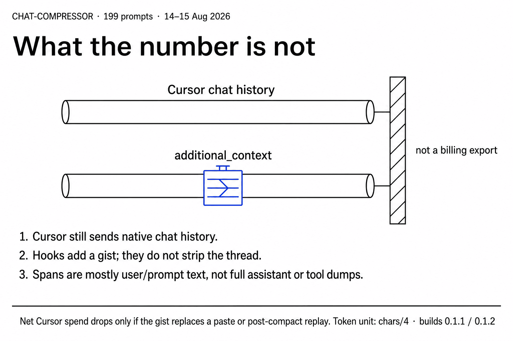

# How this was measured

On a 199-prompt corpus, packed inject forwarded about **one sixth** the estimated tokens of full-corpus replay (**84% fewer**). That is the memory-inject path (`chars/4`), not a Cursor billing export.

This page walks the five manuscript cards in order. Display numerals are rounded; exact arithmetic is given in each section. A second, separate lab/live SDK probe (184 / 19,938 estimated forward tokens; about 34% fewer billed tokens than raw replay on that probe) is tabulated at the end and documented in [WHY.md](WHY.md). Do not merge the two probes.

Eyebrow on every card: `CHAT-COMPRESSOR · 199 prompts · 14–15 Aug 2026`. Builds on the inject-corpus alignment: `0.1.1 / 0.1.2`. Token unit: `chars/4`.

## 1. Result

  

| Display | Exact |
| --- | ---: |
| 84% fewer forwarded | 83.8% |
| 862,000 replay | 862,201 |
| 139,000 packed | 139,465 |
| 723,000 not replayed | 722,736 |
| Cap / median | 1,024 / 783 |

Exact line: `862,201 − 139,465 = 722,736 → 83.8%`.

**Ratio illustration (not an invoice):** `139,465 / 862,201 ≈ 16.2%` ≈ about 1/6.2 of replay inject volume. If replay inject volume = **$1.00**, packed inject ≈ **$0.18**. Equivalent: about **6×** as far for the same inject-path token budget. Condition: the packed gist is used instead of pasting or replaying that corpus as `additional_context`. Native Cursor chat history is still sent and is outside this dollar picture. This is a unit conversion of the token ratio on the memory-inject path (`chars/4`), not a Cursor billing export and not a measured $/token price.

Mechanism: each prompt in the corpus is scored two ways — dump ingested prompt text as `additional_context` (replay), or emit a packed inject under a 1,024-token cap. Outcome: packed inject is about one sixth of replay volume (139,465 / 862,201). Scope: estimated inject tokens on this corpus, `chars/4`. The 84% figure, the 723,000 display delta, and the 18¢ / 6× ratio illustration are not a Cursor billing cut.

## 2. Comparison

  

| Arm | What is forwarded |
| --- | --- |
| Baseline (replay) | Dump ingested prompt text as `additional_context` every turn |
| Compressor (pack) | Pack under a 1,024-token budget |
| Same corpus | Same ingested prompts; no billing export |

`Savings = replay sum − packed sum`.

Mechanism: both arms start from the same ingested prompt text. Replay resends that text on every turn; the compressor selects a bounded pack. Outcome: the headline delta is the difference of those two sums. Scope: inject-path volume only. The comparison does not strip Cursor's native chat history and does not report billed cost.

## 3. Mechanism

  

| Control | Value |
| --- | ---: |
| Cap | 1,024 |
| Median inject | 783 |

Order under budget pressure: `HOT_SET` first, typed graph lines second, query-ranked chunks third. `packed_tokens ≤ 1,024`.

Mechanism: local compressed state is projected into ordinary text. Active items occupy the head of the pack so they survive truncation; typed lines (`OpenItem:`, `Fact:`, `Path:`, `Event:`) come next; ranked verbatim spans fill the remainder. Outcome: median inject on this corpus is 783 estimated tokens, under the 1,024 cap. Scope: this is the memory-inject path. Pattern-1 vocabulary decode is not part of this measurement.

## 4. Dedup

  

| Display | Exact |
| --- | ---: |
| 46% yield | 46% |
| 66,000 dropped (display) | 65,944 |
| Metered turns | 147 |

On 147 metered turns, 65,944 candidate tokens were dropped as duplicates (46% yield). This is inside the inject stream; it is not added to the 723,000.

Mechanism: the packer skips last-K lines already sent on the inject path so the same span is not re-forwarded as `additional_context`. Outcome: 65,944 candidate tokens dropped on 147 turns. Scope: an internal inject-stream filter. It does not increase the replay-minus-packed headline, and it is not a billing line item.

## 5. Scope

  

Honesty lines (locked):

1. Cursor still sends native chat history.
2. Hooks add a gist; they do not strip the thread.
3. Spans are mostly user/prompt text, not full assistant or tool dumps.

Net Cursor spend drops only if the gist replaces a paste or post-compact replay.

Mechanism: Cursor continues to send its native thread; comPREssOR adds a bounded gist on the `additional_context` channel. Outcome: the 84% / 723,000 inject-path figures measure that added channel against a replay of ingested prompt text. Scope: not a billing export. Do not read 84%, 723,000, **18¢ on the replay dollar**, or **6×** as a Cursor billing cut or invoice. The one-sixth / ~$0.18 ratio is replay volume on the inject path, not expected billed cost. The dollar picture applies only when the packed gist replaces a paste or post-compact replay of that corpus; native history remains outside it.

## Two probes

Keep these measurements separate. The inject corpus is a 199-prompt `chars/4` comparison of packed inject vs full-corpus replay. The lab/live SDK probe is a different fixture, a different arm set, and the only public billed comparison.

| Probe | What it measures | Locked numerals | Billing? |
| --- | --- | --- | --- |
| 199-prompt inject corpus (14–15 Aug 2026) | Packed inject vs full-corpus replay of ingested prompt text | Replay 862,201 → packed 139,465 → delta 722,736 → 83.8% (display 84% / 139k / 862k / 723,000). Cap 1,024, median 783. Dedup 65,944 / 46% on 147 turns. Unit `chars/4`. Builds 0.1.1 / 0.1.2 | No. Memory-inject path, not a Cursor billing export |
| Lab/live SDK probe | Raw replay vs legacy vocabulary bag vs comPREssOR pack on one fixture; live billed totals include the SDK envelope | Final-turn estimated forward tokens: raw 19938, bag 27, pack 184. `entity_recall` 1.00 / 0.00 / 0.33. Live billed totals 31971 / 22352 / 21050. About 34% fewer billed tokens than raw replay **on that probe** | Yes, for that probe only. Billed input is not gist-only payload size |

Theory, SDK table, and honesty ledger: [WHY.md](WHY.md). System constraint: do not invent stronger performance claims than the measured probes ([SYSTEM.md](SYSTEM.md)).

**Alternatives (mechanism only unless measured):** The inject corpus scores pack vs replay stuffing only. The SDK probe adds the vocabulary-bag cautionary arm (size vs recall). last-N truncation, summary-only digests, and codebase RAG are **not** scored here; see the README comparison table and the [WHY.md](WHY.md) honesty ledger.

## Re-run note

Logs for the inject-corpus alignment come from the local state root (default `$HOME/.cursor/context-graphs/`). Token estimates use `chars/4`. The cards record engine builds `0.1.1 / 0.1.2`. Regenerating the PNGs is out of scope for this page; the numerals above are the locked set.

To inspect a later session: compare packed inject size against a replay of ingested prompt text on the same corpus, under the same unit, without treating the result as a Cursor billing export.
