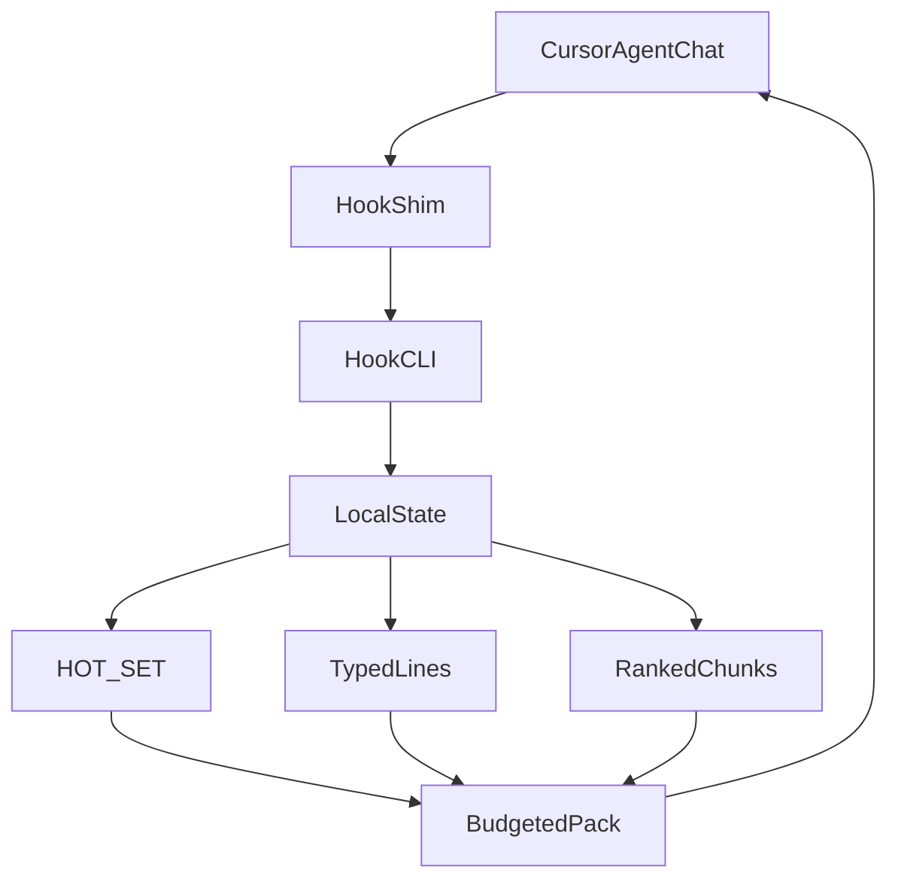

# How comPREssOR works and how to steer it

comPREssOR is a Cursor-only extension plus a vendored Python engine. Its purpose is to keep compressed local memory for long Agent Chat sessions and inject a bounded text pack into later turns. The mechanism is local state update on hook events, followed by budgeted context assembly. The observable outcome is that Cursor receives ordinary text containing active items, typed facts, and selected spans. The scope boundary is that comPREssOR is not a model, not codebase RAG, not hidden-state transport, and not a guarantee of better answers.

For a prompt engineer, the core model is simple:

```text
prior turns -> local compressed state -> bounded forward text -> next Cursor turn
```

The implementation has two major parts:

- `extension/`: a TypeScript Cursor extension that gates activation, provisions the Python runtime, writes configuration, installs hooks, and deploys Cursor rule/skill assets.
- `engine/`: a Python package that receives hook payloads, updates local state, and returns event-safe JSON to Cursor.

The system is intentionally fail-open after activation. If a hook side process fails, the current Agent Chat turn proceeds without injected context. The extension should improve continuity when healthy, but it should not block ordinary prompting when unavailable.

Theory lives in [WHY.md](WHY.md) (utility framing) and [THEORY.md](THEORY.md) (formal equations and registries). Measurement lives in [PERFORMANCE.md](PERFORMANCE.md). Hook JSON defaults live in [HOOK_CONTRACT.md](HOOK_CONTRACT.md). This document is the architecture and utilization guide: how activation works, what each hook does, where state lives, how the pack is built, and how to steer the system with ordinary prompt craft.

## Problem statement for prompt engineers

Context is a budget, not a place to replay everything.

A long Agent Chat session accumulates decisions, file paths, open items, failed hypotheses, tool output, and social framing. Continuity matters: the next turn should still know which file is in scope, which design was accepted, which test is failing, and which decisions remain open. The blunt way to preserve continuity is to paste or replay the full transcript. That works until the history competes with the current task for tokens, latency, and attention.

Raw history grows with the session:

```text
H_t = all turns up to turn t
```

If each turn adds text, replaying `H_t` makes prompt cost track the accumulated session rather than the new request. A short conversation can tolerate that. A multi-hour implementation loop, release-prep pass, or debugging thread often cannot.

Compression alone is not the answer either. A tiny summary that drops the relevant path or open item may be cheaper but less useful. A vocabulary bag can be extremely small and still fail to tell the model what was decided. The useful objective is:

```text
forward_payload <= budget
```

and the payload should still carry the entities, files, decisions, and open items the next prompt depends on.

comPREssOR treats that as an engineering problem with a visible mechanism. It observes hook events, stores dual local memory (symbolic graph plus bounded matrix state), and injects a text pack ordered for budget pressure: active items first, typed facts second, query-ranked spans third. Cursor still receives text only. The model cannot see local SQLite rows, safetensors blobs, or span sidecars unless those materials are projected into the pack.

This changes how a prompt engineer should write turns. Durable facts should be stated as facts. Paths should be written as paths. Open work should be labeled as open. Completions should be stated directly. The system extracts from observed text; it does not infer unspoken intent. When you write for extraction, the pack becomes easier to steer. When you bury decisions in vague prose, the pack becomes thinner and less reliable.

The practical question for each turn is therefore not "how do I resend everything?" It is "what must survive the budget into the next turn, and have I written that material in a form the extractor can keep?"

## End-to-end flow



The diagram is deliberately text-only at the model boundary. Cursor receives the budgeted pack, not the local store. The store remains on disk and is used to decide what text to forward. Hook failures degrade to ordinary Agent Chat without the pack; they do not block the turn.

## Cursor extension lifecycle

Activation is a sequenced pipeline. Understanding the order helps when first-run setup fails or when a Cursor update changes the host environment.

### Host gate

The first meaningful operation in extension activation is host detection. The extension reads the host identity signals exposed by the editor:

- URI scheme must be `cursor`.
- Application name must contain `Cursor`.
- Application host must be `desktop`.
- Remote name must be empty.

If those checks pass, comPREssOR registers commands and may provision runtime assets. If any check fails, activation denies side effects. On a denied host the extension sets the `chatCompressor.hostSupported` context to false, logs the host signals, shows a warning or details path, and performs no writes under the Cursor data directory.

This is activation enforcement, not install-time enforcement. The VSIX format cannot prevent a user from sideloading the package into another VS Code-compatible host. The honest behavior is: install can succeed, activation refuses to operate. The extension also avoids capability probing on denied hosts because probing would require touching the files the gate exists to protect.

The setting `chatCompressor.strictHostGate` controls warning behavior only. Setting it to false can soften the deny UI, but it does not enable hook installation, runtime provisioning, or data writes on unsupported hosts. Commands that mutate state re-check the host live and refuse again if the host is no longer allowed.

### Runtime provisioning (venv)

On an allowlisted Cursor desktop host, activation calls the runtime provisioning path. The extension discovers a Python interpreter in this order:

1. `chatCompressor.pythonPath`, if configured.
2. The Python extension execution details, if available.
3. `python3`.
4. `python`.

The interpreter must be Python 3.11 or newer. If no suitable interpreter is found, provisioning fails with a clear message asking the user to set `chatCompressor.pythonPath`.

The extension creates a private virtual environment under the extension global storage area and installs the bundled `chat_compressor` wheel into that environment. It upgrades `pip`, force-reinstalls the wheel for the extension version, and sanity-checks the hook CLI by running its help path. It does not install packages into the workspace interpreter or the system interpreter.

The runtime path is idempotent. If the recorded wheel version matches and the venv Python exists, activation reuses it. The command `comPREssOR: Reprovision Python Runtime` forces the runtime path to run again, then rewrites the environment file.

The first activation can need network access because Python wheel dependencies such as `numpy` and `safetensors` may be installed into the venv. After the runtime is provisioned, ordinary hook execution uses the local venv. If first activation fails with a missing interpreter or pip error, fix the interpreter setting and rerun repair or reprovision rather than editing the extension bundle by hand.

### Env file projection

The extension writes a managed environment file at:

```text
$HOME/.cursor/chat-compressor.env
```

The file gives the hook shim and Python CLI stable configuration outside the extension bundle. Managed keys are:

- `CHAT_COMPRESSOR_PYTHON`
- `CHAT_COMPRESSOR_STATE_DIR`
- `K_MAX`
- `GRAPH_FLUSH_EVERY`
- `CHAT_COMPRESSOR_FORWARD_BUDGET`
- `CHAT_COMPRESSOR_INJECT_P1`

Unmanaged lines are preserved. The extension deliberately omits secret material and drops accidental Cursor API key lines if they are present. The hook path does not require a Cursor API key. Live SDK lab scenarios may use one, but that is outside the installed extension's hook configuration.

The default state directory is:

```text
$HOME/.cursor/context-graphs/
```

`chatCompressor.stateDir` can override that path. `chatCompressor.kMax`, `chatCompressor.graphFlushEvery`, `chatCompressor.forwardBudget`, and `chatCompressor.injectP1` project into the corresponding engine variables. When settings change, the extension re-checks the host and rewrites the env file only if the host is still allowed.

Use `comPREssOR: Open Env File` when you want to inspect the projected values. Prefer changing VS Code/Cursor settings over hand-editing managed keys, because the next settings change or repair command will rewrite those keys from configuration.

### Shim install

Cursor hooks invoke shell commands. comPREssOR installs a stable shim at:

```text
$HOME/.cursor/hooks/chat-compressor.sh
```

The registered command is relative:

```text
./hooks/chat-compressor.sh
```

That stable relative command is a compatibility invariant. `hooks.json` should not contain a version-stamped extension bundle path. Extension updates can move or replace the extension directory, but the user hook command remains stable under the Cursor data directory.

The shim loads the env file, finds the provisioned Python interpreter, and invokes:

```text
python -m chat_compressor.hook_cli
```

If the venv is missing, the env file is malformed, or the Python CLI fails, the hook path returns a safe default for the event. The observable outcome is an ordinary Agent Chat turn without injected memory rather than a blocked prompt.

### Hooks JSON merge

The extension merges hook entries into:

```text
$HOME/.cursor/hooks.json
```

It registers four Cursor hook events:

- `beforeSubmitPrompt`
- `afterAgentResponse`
- `preCompact`
- `sessionStart`

The merge policy is conservative. For each event, it removes only existing entries whose command contains `chat-compressor`, keeps all other hook entries, and then appends the stable comPREssOR shim command. If the file already exists, the extension writes a timestamped backup before replacing it. The final write uses a temp file and rename.

This means comPREssOR should coexist with other user hooks. It owns only its own hook entries. If a user has unrelated hook commands, they are preserved.

The command `comPREssOR: Install / Repair Hooks` reruns runtime provisioning, env projection, user hook installation, and asset deployment. Use it when a hook file was edited by hand, a runtime was removed, or a Cursor update changed the hook environment.

### Project hooks (opt-in)

User hooks install under `$HOME/.cursor/`. The extension also exposes `comPREssOR: Install Project Hooks (opt-in)`. That command writes or merges a project-level `.cursor/hooks.json` template in the open workspace.

Project hooks are useful when a workstream needs explicit project-level parity, for example when a cloud or shared workflow should see the same relative hook command. They are opt-in because project files belong to the repository and may be reviewed or committed by humans. The command requires an open workspace folder and still respects the Cursor host gate.

Cloud agents typically do not load the user-global `$HOME/.cursor/hooks.json`. If you need cloud parity, install the project template intentionally and treat the resulting workspace file as part of the project's reviewed tooling surface.

### Rule and skill deployment

On allowed activation with automatic hook installation enabled, the extension deploys a user rule and skill under the Cursor data directory:

```text
$HOME/.cursor/rules/chat-compressor.mdc
$HOME/.cursor/skills/chat-compressor/SKILL.md
```

These assets describe how the agent should treat compressed context. They are not model weights and do not replace the hook path. They provide human-readable and agent-readable guidance so the injected memory is interpreted as bounded session context, not as a full transcript.

The deployment path copies assets from the packaged extension resources. In development, it can fall back to the in-repository engine assets. The extension logs the deployed paths in its output channel.

The rule tells the model to prefer `HOT_SET` and extractive forward material over restating the full conversation, and not to invent stronger claims than the injected context supports. The skill is progressive disclosure for schema and hook behavior when compression topics are relevant. Neither asset changes the fail-open hook contract.

## Hook lifecycle

The Python hook CLI is the runtime boundary for Agent Chat events. It reads JSON from stdin, detects the event, resolves an agent id, updates or samples local state, writes logs, and emits JSON to stdout. It always exits with code zero.

The important distinction for prompt engineers is what each event **persists** versus what it **injects**. Persistence updates local state. Injection returns text Cursor may attach as additional context. Not every event does both.

| Event | Persists? | Injects? | Failure default |
| --- | --- | --- | --- |
| `beforeSubmitPrompt` | Yes: user prompt via `step()` | Yes: query-conditioned pack as `additional_context` | `{"continue": true}` |
| `afterAgentResponse` | Yes: assistant reply via `step(role=assistant)` | No | `{}` |
| `preCompact` | Yes: forced graph flush + precompact snapshot | Message about snapshot, not full graph | `{}` |
| `sessionStart` | Yes: forced graph flush | Yes: pack without specific query | `{"additional_context": ""}` |

### `beforeSubmitPrompt`

This event fires before the user's prompt is submitted. The CLI extracts the prompt, resolves the agent id, builds a `PersistentAgentHandle`, and calls `step(prompt, role="user")`.

`step()` loads the latest state for that agent, compresses the new text into the bounded matrix, updates the graph, persists a new `StateNode`, writes span sidecars, and saves the current graph. After persistence, the CLI samples forward context with the current prompt as the query. It composes additional context from the sampled pack plus a `STATE` line and returns:

```json
{"continue": true, "additional_context": "..."}
```

What persists:

- A new parent-linked `StateNode` for the user turn.
- Updated matrix blob and span sidecar for that turn.
- Updated working graph, plus a versioned graph snapshot when the flush cadence hits.

What injects:

- A budgeted text pack conditioned on the current prompt.
- A `STATE` line with agent id, turn index, and state id.

If sampling fails after persistence, the event still returns `{"continue": true}`. The prompt proceeds. Persistence may have succeeded even when injection is empty. That is why stage logs matter during debugging: a turn can update local memory without successfully projecting it forward.

### `afterAgentResponse`

This event fires after the assistant response. The CLI extracts assistant text and calls `step(reply, role="assistant")`. The effect is that the assistant's decisions, summaries, paths, and open-item changes can enter local state for future turns. The event returns `{}`.

What persists:

- Assistant text as a turn in local state.
- Graph updates from assistant-written paths, facts, completions, and open items.
- Matrix and span updates for the assistant turn.

What injects:

- Nothing on this event. Injection happens on the next `beforeSubmitPrompt` or on `sessionStart`.

If no assistant text is present, the handler returns `{}` without changing state. This is why assistant summaries that explicitly close open items or restate accepted decisions are valuable: they become extractable material for later user turns.

### `preCompact`

This event fires before a compaction boundary. The CLI loads the graph for the agent, forces a graph flush, writes a pre-compact graph snapshot and metadata file under the agent's local state directory, logs the stage, and returns a user message describing the snapshot.

What persists:

- Forced working-graph and versioned-graph flush.
- A frozen snapshot under the agent's `precompact/` directory, with accompanying metadata.

What injects:

- A short user-facing message that a snapshot was taken.
- Not the full graph, not the matrix, and not a full transcript substitute.

The observable outcome is a frozen local graph snapshot before Cursor compacts the visible conversation. Compacted UI history may become thinner while local state retains the pre-compact graph. Continuity after compaction still depends on later sampling from that local state, not on shipping the snapshot wholesale to the model.

### `sessionStart`

This event fires when a session starts. The CLI loads existing state, forces a graph flush, samples a forward pack without a specific query, composes additional context, and returns:

```json
{"additional_context": "..."}
```

What persists:

- Forced graph flush so the working graph is current before sampling.

What injects:

- A budgeted pack based on existing local memory.
- Because there is no fresh user prompt as query, ranking is less query-specific than `beforeSubmitPrompt`. Active HOT_SET and typed lines still dominate under budget pressure.

This is the event that helps a new session start with compact memory from prior local state when an agent id resolves to existing history. If the agent id does not resolve to prior state, the pack is empty or minimal and the session starts cleanly.

## Local state layout and lineage

The default state root is:

```text
$HOME/.cursor/context-graphs/
```

Inside that root, comPREssOR maintains:

- `meta.sqlite`: SQLite metadata for agents and state lineage.
- Per-agent directories: one directory per resolved agent id.
- `tNNNN.safetensors`: local tensor blobs containing matrix state.
- `tNNNN.spans.json`: local verbatim span sidecars used for retrieval support.
- `graph.json`: the current working graph for the agent.
- `graph_tNNNN.json`: versioned graph snapshots at the configured flush cadence.
- `precompact/`: graph snapshots and metadata created before compaction.
- `logs/`: hook stage logs and error logs.

A typical per-agent layout looks like:

```text
context-graphs/
  meta.sqlite
  logs/
    hook-errors.log.txt
    stages-YYYYMMDD.log.txt
  <agent_id>/
    graph.json
    graph_t0005.json
    graph_t0010.json
    t0001.safetensors
    t0001.spans.json
    t0002.safetensors
    t0002.spans.json
    precompact/
      ...
```

The state model is parent-linked. Each saved `StateNode` records its `state_id`, `parent_id`, turn index, producer metadata, blob path, graph path, and creation time. Tensor blobs are written with `safetensors`, not pickle. SQLite stores metadata and file paths; safetensors stores arrays such as `C`, `M`, and optional `KV`.

Lineage matters for debugging and for understanding continuity:

- `parent_id` links each saved node to the previous node for that agent.
- Turn index `t` increases as hooks persist user and assistant text.
- Blob and graph paths tell you which files belong to which turn.
- Versioned graph snapshots are cadence-based checkpoints, not every-turn duplicates by default.
- Precompact snapshots are freeze points for compaction boundaries.

The graph uses the `ctx-graph/v1` shape. Node kinds include `Turn`, `Topic`, `Fact`, `OpenItem`, and `Event`. Edge relations include `mentions`, `contains`, `continues`, `supersedes`, and `derived_from`. Explicit topic, goal, and workstream markers create active topics. Design, decision, and outcome statements are stored as durable facts with compatible attributes. Completion language can supersede earlier open items, and pruning keeps active turns and non-durable facts bounded.

The state root remains local. Uninstall removes hook entries and deployed assets, but it does not automatically delete `context-graphs/`. Use the `comPREssOR: Purge Context Graphs` command when you intentionally want to delete local state. That command prompts before deleting because the action is destructive. Purging is appropriate when a workstream is intentionally disposable, when state is contaminated by a bad experiment, or when you want a clean baseline for a new durable thread.

## Dual memory: graph versus matrix

comPREssOR keeps two local memories in parallel. They solve different parts of the continuity problem.

### Symbolic graph memory

The graph stores named, human-readable durable material extracted from observed turns. In plain language:

- Topics are active workstreams that orient later query-specific packs.
- Open items are active work that should survive budget pressure.
- Paths are file anchors that keep later turns pointed at the right artifacts.
- Facts are durable statements such as accepted decisions, design structure, constraints, or measured outcomes.
- Events capture notable transitions and completion outcomes.
- Turns provide temporal structure and window text.

The graph is the memory you can inspect and steer with prompt craft. If you write:

```text
Open item: finish scrub checks on SYSTEM.md
Decision: keep hook merge fail-open
Topic: documentation refresh
Path: docs/SYSTEM.md
```

those lines are much more likely to become typed graph material than a vague paragraph that only implies the same content. Completing an item with direct language such as `Completed: finish scrub checks on SYSTEM.md` gives the graph a cue to supersede the prior open item so stale work does not dominate later packs. Outcome statements such as `Validation: 0 broken links` or `Completed: 35 entries standardized` become high-priority graph material.

### Matrix memory

The matrix is a bounded numeric digest of recent compressed turns. New text is encoded into rows, appended, and pooled so the live slot count stays within `K_MAX`. The matrix is local. It supports compact state continuity and ranking support. It is not sent to Cursor as floats or tensors.

In plain language: the graph is the labeled notebook; the matrix is the compact numeric digest that helps the engine keep a bounded memory footprint and score candidate spans. The model never receives the matrix directly. The model receives text projected from graph content and selected spans.

### Why both exist

If you only had a matrix, you would have a compact digest without stable typed labels for open items and paths. If you only had a graph, you would have readable facts but weaker support for selecting relevant verbatim spans under a query. The forward pack uses both tracks: the graph contributes HOT_SET and typed lines; span/window material contributes ranked chunks; ranking uses hashed n-gram similarity against the current query.

The observable outcome for the prompt engineer is simple. Write clear durable text so the graph can keep it. Expect the pack to prioritize that durable text. Expect supporting prose to appear only when it ranks well and budget remains.

## Forward pack recipe and what the model sees

The primary forward sampling path is `sample_for("cursor-sdk")`. Despite the target name, the same text-only policy is what the Cursor hook uses.

The recipe is:

1. Load latest local state for the agent.
2. Ask the graph for query-aware `hot_set()`.
3. Convert active graph memory into typed projection lines.
4. Collect candidate chunks from graph/window/span material.
5. Rank chunks against the current query using hashed n-gram similarity.
6. Pack in this order: `HOT_SET`, typed lines, ranked chunks.
7. Stop when the approximate token budget is reached.
8. Add a `STATE` line containing agent id, turn index, and state id.

Token estimates use a simple character-based estimator. The default forward budget is 1024 approximate tokens, configurable through `chatCompressor.forwardBudget`. The hook also applies an 8000-character hard cap to the final additional context string as a second guardrail.

### What the model sees

The model sees ordinary text, typically shaped like:

```text
HOT_SET
OpenItem ...
Fact ...
Path ...

OpenItem: ...
Fact: ...
Path: ...
Event: ...

<selected verbatim chunks>

STATE agent=... t=... state_id=...
```

Exact formatting can vary with extracted content, but the priority order is stable:

1. **HOT_SET** survives first under budget pressure. Active topics and open items lead, followed by design, decision, and outcome facts. Durable paths and headings remain in the graph, but query-relevant ones outrank unrelated early-session paths.
2. **Typed lines** make kind explicit: `Topic:`, `OpenItem:`, `Fact:`, `Path:`, `Event:`. Labels reduce ambiguity for the model.
3. **Ranked chunks** preserve selected wording when budget remains. They are the first region to shrink when the budget is tight.
4. **STATE** identifies which local node produced the pack. It is metadata for continuity and debugging, not a transcript dump.

What the model does **not** see:

- Raw safetensors matrices.
- SQLite tables.
- Full span sidecars unless selected text was packed.
- Private absolute machine paths that were never present in conversation text.
- Pattern-1 vocabulary decode, unless explicitly enabled and gated.

Pattern-1 vocabulary decode exists for debugging and compatibility experiments. It is not part of the default forward channel. The setting `chatCompressor.injectP1` can allow Pattern-1 text only when the engine's gate accepts it and budget remains. For normal use, keep it disabled.

### Budget behavior

Under a small budget, expect supporting chunks to disappear before HOT_SET and typed lines. That failure mode is intentional and easier to debug than a polished summary that silently drops the active decision. If a workstream needs broader recall from older spans, raise `forwardBudget`. If injected context feels noisy for a narrow loop, lower it. Budget changes take effect through env projection; after changing the setting, confirm the env file reflects the new value.

## Settings with practical guidance

The extension contributes these user-facing settings:

| Setting | Default | Practical guidance |
| --- | --- | --- |
| `chatCompressor.pythonPath` | empty (auto-discover) | Set this when auto-discovery finds an old Python or no Python. Must be 3.11+. |
| `chatCompressor.stateDir` | empty → `$HOME/.cursor/context-graphs/` | Override when you want separate memory roots for different environments or disposable experiments. |
| `chatCompressor.kMax` | `32` | Caps matrix slots. Leave at default unless you are intentionally changing compression footprint. |
| `chatCompressor.graphFlushEvery` | `5` | Versioned graph snapshot cadence in turns. Lower for denser checkpoints; higher for fewer snapshot files. |
| `chatCompressor.forwardBudget` | `1024` | Primary steering knob. Raise for broader recall; lower for narrow loops. |
| `chatCompressor.injectP1` | `false` | Debug/compatibility only. Keep off for normal prompt engineering. |
| `chatCompressor.strictHostGate` | `true` | Softens deny UI only when false. Never enables writes on unsupported hosts. |
| `chatCompressor.autoInstallHooks` | `true` | On allowed activation, install shim, merge hooks, and deploy assets. Disable only if you manage hooks manually. |
| `chatCompressor.enableProjectHooksCommand` | `true` | Exposes the opt-in project-hooks command. Disable if you do not want that command visible. |

Prompt engineers usually tune only `forwardBudget` and sometimes `stateDir`. Leave host-gate and runtime settings alone unless activation or repair fails.

Concrete tuning examples:

- Narrow bugfix in one file: keep `forwardBudget` at or below default so HOT_SET and a few typed lines dominate.
- Long design thread with many paths and open items: raise `forwardBudget` so ranked chunks can retain supporting phrasing.
- Disposable experiment: point `stateDir` at a temporary directory, then purge or discard it when finished.
- Shared machine with multiple work styles: use separate state directories rather than mixing unrelated durable threads in one root.

## Utilization patterns

Use one durable thread per workstream when possible. comPREssOR maintains state by resolved agent identity. Keeping related work together gives the system repeated exposure to the same paths, headings, open items, and decisions. Splitting one feature across many unrelated chats creates thin, fragmented memory.

### Write durable facts explicitly

Prefer:

```text
Decision: keep the hook merge fail-open.
Open item: validate README links to WHY.md and SYSTEM.md.
Constraint: do not invent stronger performance claims than the measured probe.
```

Avoid relying on indirect implications such as "we should probably be careful about the numbers." The graph does not read your mind; it observes text.

### Mention files by path

Paths are durable graph facts. Prefer:

```text
Path: extension/src/cursorBridge.ts
Update the merge policy in docs/HOOK_CONTRACT.md after changing the shim.
```

A stable path gives the forward pack an anchor that can be carried into later turns. Relative repo paths are usually enough and scrub cleanly.

### Use headings as phase markers

Headings help both humans and extractors. Before a phase change, write a short heading and the active state:

```text
## Hook repair checkpoint
Open item: confirm hooks.json still has four chat-compressor events.
Decision: use Install / Repair Hooks rather than hand-editing.
```

Those markers make later packs easier to interpret when the model sees typed lines and HOT_SET fragments from that phase.

### Close open items in direct language

Prefer:

```text
Completed: validate scrub checks.
```

or:

```text
Done: README links resolve.
```

This helps prevent stale open items from occupying the highest-priority region of future packs. If an item is deferred rather than completed, say so explicitly so the graph does not treat silence as closure.

### Summarize decisions at phase boundaries

Before a long debug session, state the current hypothesis, accepted constraints, and next test. Before switching tasks, state what remains open. Those compact human-written facts are high-value material for the pack and often more useful than replaying a long tool log.

Example:

```text
Hypothesis: injection is empty because hooks.json lost the sessionStart entry.
Next test: run Compatibility Report, then Install / Repair Hooks, then inspect stages log.
Open item: confirm beforeSubmitPrompt appears in today's stages log.
```

### When to raise the budget

Raise `forwardBudget` when:

- The workstream depends on older verbatim phrasing, not just open items and paths.
- Multiple related files and constraints must remain visible in the same turn.
- Session-start packs feel too thin after compaction.

Keep or lower the budget when:

- The current loop is narrow and HOT_SET already carries the active item.
- Injected context is crowding out the actual request.
- You are intentionally testing fail-open behavior or pack minimalism.

### Prefer packed memory over full transcript paste

If the task requires exact old wording, attach or quote that source directly. If the task requires remembering decisions and open items, let comPREssOR carry the bounded pack and keep your prompt focused on the current operation. Pasting the entire transcript back into the prompt defeats the budget model and can reintroduce the problem the extension exists to manage.

### Use project hooks for cloud parity intentionally

User hooks are enough for local Cursor desktop use. Project hooks are visible workspace files and should be treated as an explicit project choice. Install them when cloud or shared agents need the same relative shim command and when the team is willing to review `.cursor/hooks.json` as project tooling. Do not assume user-global hooks travel with a cloud agent.

### Example workstream pattern

A durable documentation refresh thread might look like this across turns:

1. State the goal and paths once: `Path: docs/SYSTEM.md`, `Path: docs/WHY.md`, `Open item: expand SYSTEM.md into the 4000–6500 word band`.
2. Keep decisions explicit: `Decision: deepen utilization and debugging sections rather than padding`.
3. After each completed section: `Completed: dual-memory section`.
4. Before the final validation turn: `Open item: run wc -w and scrub checks`.
5. Let later prompts stay short: "Finish scrub checks and confirm word count." The pack should already carry the durable state if the thread stayed coherent.

## Debugging playbook

Start with the Output channel named `comPREssOR`. The extension logs host decisions, runtime provisioning commands, env projection, hook installation, hook backups, asset deployment, and compatibility report facts.

### Step 1: confirm the host

Run `comPREssOR: Compatibility Report`. On an allowed host, the report should show allow plus the observed signals. On a denied host, the report explains the deny code. Do not chase missing injection on a denied host; activation side effects never ran.

### Step 2: confirm runtime and env

Check:

- Python 3.11+ was discovered or `chatCompressor.pythonPath` is set.
- The private venv exists under extension global storage.
- `$HOME/.cursor/chat-compressor.env` contains managed values.
- `CHAT_COMPRESSOR_PYTHON` points at the provisioned venv interpreter.
- `CHAT_COMPRESSOR_STATE_DIR` points at a writable directory.
- `CHAT_COMPRESSOR_FORWARD_BUDGET` matches the setting you think you are using.

If the venv is stale or missing, run `comPREssOR: Reprovision Python Runtime`.

### Step 3: confirm hooks and shim

Check:

- `$HOME/.cursor/hooks.json` has the four events with `./hooks/chat-compressor.sh`.
- `$HOME/.cursor/hooks/chat-compressor.sh` exists and is executable.
- Unrelated hooks are still present if you expect them; merge should not wipe them.

If hooks were overwritten by another tool, run `comPREssOR: Install / Repair Hooks`. Prefer repair over hand-editing unless you are intentionally managing a custom setup.

### Step 4: inspect stage and error logs

Inspect local hook logs under:

```text
$HOME/.cursor/context-graphs/logs/
```

`hook-errors.log.txt` records Python-side errors. `stages-YYYYMMDD.log.txt` records hook events with agent id, turn index, state id, method, packed token estimate, budget, rank time, and flush status.

Useful questions for the stages log:

- Do `beforeSubmitPrompt` and `sessionStart` appear at all?
- Is the agent id stable across the workstream?
- Is packed token estimate zero or near zero while state ids advance?
- Does `preCompact` appear around compaction boundaries?

If state ids advance but injection is empty, persistence may be working while sampling or composition is failing. That is a different bug from "hooks never ran."

### Step 5: validate state writability and lineage

Confirm the state directory is writable and that the agent directory gains new `tNNNN.safetensors`, span sidecars, and graph updates as you converse. If no files appear, the hook is not successfully persisting. If files appear but packs remain empty, inspect extraction quality and budget settings.

### Step 6: interpret fail-open correctly

Fail-open behavior is expected during errors. A broken hook should degrade to ordinary Agent Chat. That means the absence of injected memory is a bug to inspect, not a reason for the current prompt to fail. Do not treat "the prompt still worked" as proof that memory injection worked. Check logs and pack content.

### Common recovery commands

- `comPREssOR: Install / Repair Hooks` after hook-file damage or Cursor updates.
- `comPREssOR: Reprovision Python Runtime` after interpreter or venv problems.
- `comPREssOR: Open Env File` to inspect projected configuration.
- `comPREssOR: Compatibility Report` to verify host allow/deny.
- `comPREssOR: Purge Context Graphs` only when local state should be intentionally destroyed.

## Non-goals and boundaries

comPREssOR is not codebase RAG. It does not crawl your repository and retrieve arbitrary files. It only knows what hook-observed conversation text and configured state contain. If a file was never discussed or attached, do not expect the pack to invent its contents.

It is not a replacement for explicit attachments. If a turn depends on exact content from a file, attach or reference the file in the normal Cursor way. The compressed pack can carry paths and selected spans, but it is not a full source mirror.

It is not model fine-tuning. No model weights are trained by the extension. The optional local producer paths in the engine are local encoding choices, not changes to the Cursor model.

It is not hidden-state transport. Local matrices, graph files, span sidecars, SQLite metadata, and safetensors blobs remain local. The model receives text only. There is no claim that Cursor models consume latent tensors from this extension.

It is not an install-time VS Code blocker. Unsupported hosts can install a VSIX, but activation refuses side effects.

It is not a universal answer-quality guarantee. A bounded pack can omit details. Extraction can miss vague facts. Ranking can select the wrong span. A low budget can remove useful context. The correct claim is narrower: comPREssOR supplies a bounded, local, typed forward-context mechanism that can improve long-session continuity when the relevant material is extractable and the prompt engineer writes durable state into the conversation.

It is not a substitute for writing clear prompts. The system amplifies extractable structure. It does not repair ambiguous instructions, missing acceptance criteria, or contradictory decisions. If two open items conflict, the pack may carry both until you close or supersede one.

It is not cloud-global by default. User hooks live under the local Cursor data directory. Cloud parity requires intentional project hooks and an understanding that the remote environment must be able to invoke the same relative command successfully.

For measured outcomes and honesty about what those metrics do and do not prove, see [WHY.md](WHY.md). For the event JSON defaults and merge invariants, see [HOOK_CONTRACT.md](HOOK_CONTRACT.md).

## Operating model

Think of comPREssOR as a local continuity assistant for Cursor Agent Chat. It observes the conversation, stores bounded state, and forwards a compact text pack. You steer it by writing clear durable facts, naming paths, closing open items, and tuning the budget when recall requirements change.

The mechanism is visible enough to debug: host gate, venv, env file, shim, hook merge, local state, stage logs, and injected text. The observable outcome is continuity without full transcript replay. The boundary is that the model can only use what the final prompt and additional context actually contain.

A prompt engineer using the system well does four recurring things:

1. Keep related work in one durable Agent conversation.
2. Write extractable state: paths, open items, decisions, completions, headings.
3. Tune `forwardBudget` when the pack is too thin or too noisy.
4. Debug with the Output channel and `context-graphs/logs/` when injection disappears, rather than pasting the whole transcript back into the next prompt.

That is the whole operating loop: write for extraction, let the hooks persist, let the pack project under budget, and inspect the local trail when behavior diverges from expectation.
